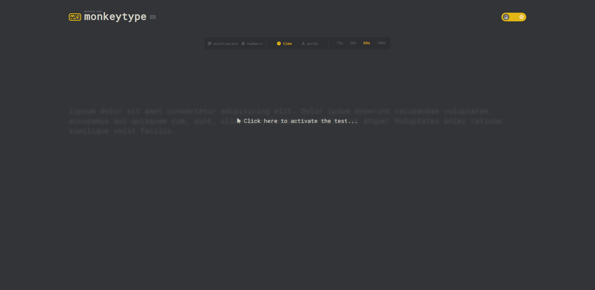
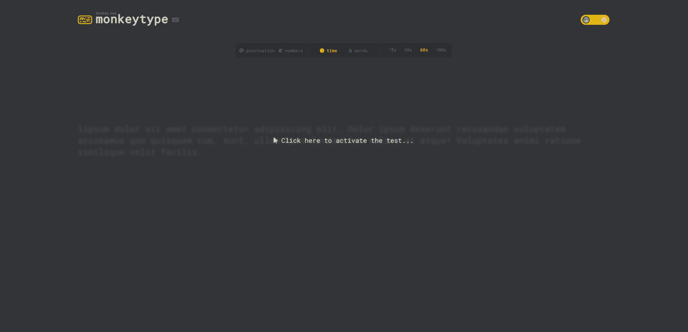

# Monkeytype Clone - A Typing Test App

This is a clone for [Monkeytype](https://monkeytype.com/). 
Which is a platform that provides users with a space to practice and improve their typing skills through fun and engaging exercises.
 
Built using only HTML,CSS and JavaScript.

## Overview

## Demo
> This gif shows a brief overview of the project, and it may take a while to load!

## Getting Started
To run this project locally using the Live Server extension in VS Code:
- Clone or download this repository
- Open the folder containing the project files in VS Code
- Install the Live Server extension
- Right click the index.html file and select "Open with Live Server"
  This will launch a development local server with hot reloading
